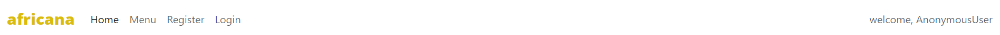

- [**UX (User Experience)**](#ux-user-experience)
  - [**User Stories**](#user-stories)
- [**Design and Site Structure**](#design-structure)
  - [**Functional Structure**](#functional-structure)
  - [**Wireframes**](#wireframes)
- [**Features**](#features)
  - [**Responsive Design**](#responsive-design)
- [**Technologies**](#technologies)
  - [**Languages**](#languages)
  - [**Frameworks and Libraries**](#frameworks)
  - [**Tools**](#tools)
- [**Testing**](#testing)
- [**Deployment**](#deployment)
- [**Credits**](#credits)
  - [**Code**](#code)
  - [**Content**](#content)
  - [**Media**](#media)
  - [**Inspiration**](#inspiration)
  - [**Acknowledgments**](#acknowledgments)

  
# Portfolio Project 4 -  

The deployed [Africana](https://django-africana-eatery-ed503b69cf5f.herokuapp.com/) app.

The [GitHub repository](https://github.com/osaroo3/django_restaurant_ci_project4) 

## Project goals
The goals of this project is to develop an eatery/resturant web application with features, such as date/time-based bookings,
multiple table occupancies, cancellations, menu and double bookings prevention. This portfolio project 4 is a requirement in order to obtain a Diploma from Code Institute in Fullstack Software Development (E-Commerce Applications).

## UX (User Experience)

### User stories

#### First time visitor goals

As a first time visitor, I want:
* to know the purpose of the site at first glance.
* to navigate the site intuitively.
* to have access to all features of the site after registering an account.
* to be able to make online reservations.
* to be able to sign out of my user account.
       
        
#### Returning and frequent user goals

As a returning user, I want:
* to access my user account by signing in.
* to make and view my reservations.
* to be able to update and delete my reservations. 
* to edit my booking details or delete them.
* to be able to sign out of my account as a safety measure.

#### Site Administrator goals
As a site administrator, I want to create, read, update and delete bookings/reservations.    

[Back to the top](#table-of-contents)

### Agile tools

GitHub Projects feature was used as a [Kanban board](https://github.com/users/osaroo3/projects/2) for the development of this project, which made is easy to track the progress made and goals attained.
[User stories](https://github.com/osaroo3/django_restaurant_ci_project4/issues) was used to structure the project into sections of tasks to be achieved, with the kenban board providing the platform. 

## Design and Site structure

The site mirrors what an african eatery would look like in the United Kingdom or Europe to give diaspora africans a taste of home.
The main page is as viewed below.

Africana website look at first glance

 

### Functional Structure

**Home page:** The home page has navigation bar features and also some images of the varieties of the african dishes available to users.

**Menu page:** For access to the menu to make reservations, the user must have an account and sign in.

**My bookings page:** A logged in user has access to all bookings/reservations made. The user can manage bookings by either modifying them or deleting them if they want to.

**Book now page:** A logged in user has full access to the book now page features and can make bookings if they wish to.

**Registration page:** The registration page is where the user can register an account and get access to all available features of the site

**Login page:** The login page offers a user with a user account access to all the features of the site when they log in with their login details.

**Edit booking page:** The feature is only available to registered users who wish to modify their bookings.

[Back to the top](#table-of-contents)

### Wireframes
<!-- 
The wireframes were slightly modified during the actual creation of the project, e.g. with pages installed removed form for user convenience and better UX.
The wireframes can be seen below:

**For Mobile view and small screens**

Home page

Sign up page

Services page

Bookings page

 

**For Desktop view**

Home page

Sign up page

Services page

Bookings page

 

[Back to the top](#table-of-contents)

-->

## Features

### Navbar

Due to the base extension, the navigation bar is present on all pages of the site. If the user is logged in, the right end of the nav bar changes from "Welcome, AnonymousUser to welcome, John(depending on the name of the user)". The nav bar also collapses into a hamburger icon for smaller screen sizes.

Navigation bar for user's without an account.

Navigation bar for logged in users.

### Home page

On the Home page, unauthorised users cannot see my bookings and book now links on the nav bar . 

### Sign up page

This page allows unauthorised users to create an account by following the instructions.

### Login page

This page allows user's with account to login by providing their credentials.

## Menu page

The menu button on the bav bar when clicked, takes the user to the menu page which provides users with available menu and the corresponding price to choose from.

## Book now page

The Book now button when clicked, takes the user to the book now page. For logged in user's, a table to fill to make bookings shows up. However, for user's without an account, there is a link provided to redirect them to sign up.

#### Book Now page for a logged in user

#### Book Now page for an unauthorised user

## My Bookings page

The booking page displays bookings made by the logged in user, with details about the bookings.

If there is no booking yet, the logged in user is told with a further suggestion to make bookings with a provided a link to the page to make bookings. If the user is not logged in, they are redirected to sign up page.

## Edit booking page

Every bookings made by a logged in user can be modified by either editing the bookings or deleting them. The modify and delete button exist on my bookings page.

## Delete button

Only a logged in user has access to this feature. Once this button is clicked the JavaScript code renders a modal to further get assurance that the user wants to delete that booking before deletion is done.

## Logout page

A logged in user can log out by clicking the log out button on the nav bar. This action takes the user to the sign out page to get confirmation before the user is logged out.

### Responsive design

The site was designed to be responsive for both desktop and mobile use.
This project has been tested using the Google Chrome Developer multi-device emulator with different screen sizes.

## Future features

- Email confirmation after booking is made.
- Blog page about african foods and their receipes.
- Contact page
- Comment page for customers comment about the services provided by africana.
- After been served by africana, the modify and delete buttons on the users bookings should not be visible any longer.

[Back to the top](#table-of-contents)

## Technologies Used

### Languages

  - HTML5
  - CSS3
  - JavaScript
  - Python
 

### Frameworks, Libraries, Programs

  - [Django](https://www.djangoproject.com/): python framework was used to create the backend 

### Database:
  - [PostgreSQL](https://www.postgresql.org/): the database was used to store all the data.

### Programs & Tools

- [Google Fonts](https://fonts.google.com/): Was used for the font styling.  
- [Font Awesome](https://fontawesome.com/): was used to generate the icons on the website.
- [Bootstrap](https://getbootstrap.com/): Was used to create the front-end design.
- [Gitpod](https://Gitpod.io/): was used as IDE to commit and push the project to GitHub.
- [GitHub](https://github.com/): Was used as the version control system to manage the code
<!-- - [Figma:](https://www.figma.com/) Was used to create wireframes -->
<!-- - [TinyPNG:](https://www.figma.com/) Was used to reduce the size and weight of images and optimizing interaction with the site  -->
- [Am I Responsive](http://ami.responsivedesign.is/): was used to generate an image showing the website's responsiveness on different screen sizes 
- [Pip3](https://pypi.org/project/pip/): is the package manager to install Python modules and libraries.
- [Gunicorn](https://docs.djangoproject.com/en/4.1/howto/deployment/wsgi/gunicorn/): "Green Unicorn" is a Python Web Server Gateway to translate HTTP Requests for Python to understand.
- [Spycopg2](https://pypi.org/project/psycopg2/): PostgreSQL database adapter to manage the Database in Python. 
- [Heroku](https://dashboard.heroku.com/): the hosting service used to host my website.
- [Chrome Developer Tools](https://developer.chrome.com/docs/devtools/open/): was used to debug the website.
- [W3C Validator](https://validator.w3.org/): was used to validate HTML5 codes for this website.
- [W3C CSS validator](https://jigsaw.w3.org/css-validator/): was used to validate CSS codes for this website.
- [Github Projects and Kanban board](https://github.com/users/LarisaLG/projects/17/views/1): was used to track the progress of the project.

## Testing
<!--
### Bugs

#### Fixed Bugs

|  Bug  |Bug image  |  Solution  |Status   |
|--|--|--|--|
|  
Menu on mobile devices is positioned incorrectly |  | fixed CSS style   | fixed |
|Booking form does not appear on the booking page  |  | fixed by passing form object to the booknow.html template , placing form tags in in the proper template booknow.html | fixed |
| In the Gitpod Environment the site works with full CSS style,  but on Heroku the site  and the admin page (/admin) comes up without CSS styling  | - | Set DEBUG variable to False and remove the DISABLE_COLLECTSTATIC variable | fixed |
| Function get_min_date isn't defined  | | fixed by removing function from views.py file and placing function in the forms.py so the form can access that function | fixed  |
| When an invalid phone number is entered on the Booknow page, the form clears the fields and returns to its original state with no messages to the user. The Change Booking page also returns the form to its original state with pre-filled fields | - | Added regex validation for numeric input and displaying a message to the user | fixed  |
| Pricing elements on the Services page are not displayed correctly on mobile devices |  | added media queries rules for small screen devices  | fixed  |

#### Unresolved Bugs
No known bugs remaining

[Back to the top](#table-of-contents)

### Manual Testing

#### Device Testing

The Project was tested using a multi-device emulator with different display sizes in the Google Chrome Developer Dashboard.
The following devices have been tested:

- Nest HubMax (Desktop)
- iPad Pro (Tablet)
- iPad Air (Tablet)
- iPad Mini (Tablet)
- Galaxy Tab S4 (Tablet)
- Nexus 7 (Mobile)
- Nokia N9 (Mobile)
- iPhone 5/SE (Mobile)
- iPhone 4 (Mobile)

#### Browsers Tested

Testing has been carried out on the  following browsers: 
  - Google Chrome
  - Firefox
  - Microsoft Edge

The site was constantly tested during the process of creating the site in the Gitpod Environment and the deployed site on Heroku was also tested in terms of user experience.
The available functionality and user experience is reflected in the table below.

| Goals/actions  | As a guest | As a logged user  | Result | Comment |
|--|:--:|:--:|:--:|--|
| I can use menu and navigating through pages | &check; | &check; | Pass | Click on menu item redirects to appropriate page |
| I can see the home page | &check; | &check; | Pass | |
| I can see the Services page | &check; |&check;  |  Pass| |
| I can see the Sign Up page | &check; |&check;  |  Pass| |
| I can see the Login page  | &check; |&check;  |  Pass| |
| I can see the Logout page  | &check; |&check;  |  Pass| |
| I can click the Book Now button  | &check; |&check;  |  Pass| Redirects to the page with a message that the user must register or log in for guest or shows up form for authorized user |
| I can see the Booknow page | &cross; | &check;  | Pass |A page is displayed with a message that the user must register or log in  |
| I can fill fields in the form the Booknow page | &cross; | &check;  | Pass |This page and form are available only to authorized users |
| I can see the Bookings page   | &cross; | &check;  | Pass | This page is available only to an authorized users|
| I can see the Change booking page  | &cross;  | &check;  | Pass | This page is available only to authorized users|
| I can edit booking in the form on the Change booking page  | &cross;  | &check;  | Pass |This page is available only to authorized users ||
| I can see the Delete booking page  |  &cross; | &check;  |Pass  | This page is available only to authorized users |
| |

 
-->

## Validation

### HTML Validation:

The [W3C Markup Validation Service](https://validator.w3.org/) was used to validate the HTML of the website. 
Errors was noticed when carrying out HTML validation for the sign up page. Since it's a generated form from CI codestar blog project, there is no access to the form to do the neccessary modification of the code.

Home page

Menu page

Sign up page

Login page

My bookings page

Book Now page

Modify booking page

Delete booking page

Logout page

---
### CSS Validation:

The website CSS styling was validated using [W3C Jigsaw CSS Validation Service](https://jigsaw.w3.org/css-validator/). 

---
 
### Python Validation (PEP8)

All Python code was checked manually with the aid of  [CI Python Linter](https://pep8ci.herokuapp.com/). Errors observed have all been fixed. 

urls.py

models.py

forms.py

views.py

---

<!--
##  Deployment

The project was developed using Gitpod, the project code is stored on GitHub, and then deployed to Heroku.
To deploy, follow these steps:

1. Log in to Heroku or create an account if required.
On the Welcome page in the top right corner click the button labeled 'New'.

2. From the drop-down menu select 'Create new app'.
Enter a preferred app name.
Select the relevant geographical region.
Click to 'Create App'.

3. Navigate to 'Settings' and scroll down to the 'Config Vars' section.
Click 'Reveal Config Vars' and enter 'PORT' for the key and '8000' for the value. Then click 'Add'.
Add CLOUDINARY_URL, DATABASE_URL and SECRET_KEY. URL variable values ​​must be copied from your [CLOUDINARY](https://cloudinary.com/) account  and [ElephantSQL](https://www.elephantsql.com/) account.
To create a SECRET KEY, use the online service or come up with your own.

4. Click on the 'Deploy' tab.
Next to 'Deployment method' select 'GitHub'.
Connect the relevant GitHub repository.
Under 'Manual deploy' choose the correct branch and click 'Deploy Branch'.
Also you can select 'Automatic Deploys' so that the site updates when updates are pushed to GitHub.

5. After successful deployment message in the page top right corner click the button labeled 'Open app' and you can access live app.

### Forking the GitHub Repository

To use this code and make changes without affecting the original code, it is possible to 'fork' the code on the GitHub repository through the following steps:

1. Create  or log into your GitHub account.
2. Go to the GitHub [repository](https://github.com/LarisaLG/barbershop).
3. Click the 'Fork' button in the upper right-hand corner of the page.
A copy of the repository will be available in your own repository.

### Making a Local Clone
1. Log in to GitHub and locate the GitHub Repository
2. Under the repository name choose button "Code",  click "Clone or download".
3. To clone the repository using HTTPS, under "Clone with HTTPS", copy the link.
4. Open your development editor of choice and open a terminal window in a directory of your choice
5. Type *git clone*, and then paste the URL you copied in Step 3.

``> git clone https://github.com/YOUR-USERNAME/YOUR-REPOSITORY``

Press Enter. 

Your local clone will be created.

For more information follow this [link](https://docs.github.com/en/repositories/creating-and-managing-repositories/cloning-a-repository#cloning-a-repository-to-github-desktop).

[Back to the top](#table-of-contents)

## Credits

### Code

The structure and the code of the project was based on two walkthroughs by the Code Institute:
  * Hello Django - I created CRUD functionalities based on the examples of this walkthrough.
  * From I think  therefore I blog -  I borrowed confirmation messages code and also followed the site deployment steps outlined here. 

Date picker field and minimum date validator taken from [here](https://gist.github.com/stasyao/99376eb0cf0ad3599f9737c421b5210e#part_4).

[Official Django Documentation](https://docs.djangoproject.com/en/4.1/ref/) was researched for code expressions  and code functionalities.
Django [choices fields](https://docs.djangoproject.com/en/4.1/ref/models/fields/).

Stack Overflow was used intensively for research into code functionalities and problem solving. 

### Content

The site home page is taken from the Figma community template. I slightly changed the look of the home page and tried to keep the rest of the pages in the same style.

### Media

Images were all open source and free to use from Pexels and Unsplash.

### Inspiration

This project was inspired by the Hello Django project and the I Think Therefore I Blog project.
Website template from Figma community.
Also as inspiration source for this project was used the real website [Johnny's Barber Shop](https://johnnysbarbershop.ie/). 
Aleksey Konovalov's Readme.md file was used as a template for writing Readme.md.

### Acknowledgments

Nikolay Cherniy and too_._kind from Telegram's [Django Channel](https://t.me/trueDjangoChannel) for helping right path to  render the form on the page.
Kasia for supporting all our group and for  individual support in all circumstances.
The tutor support team at Code Institute for their support.
To my friends who participated in testing my application.

[Back to the top](#table-of-contents) -->